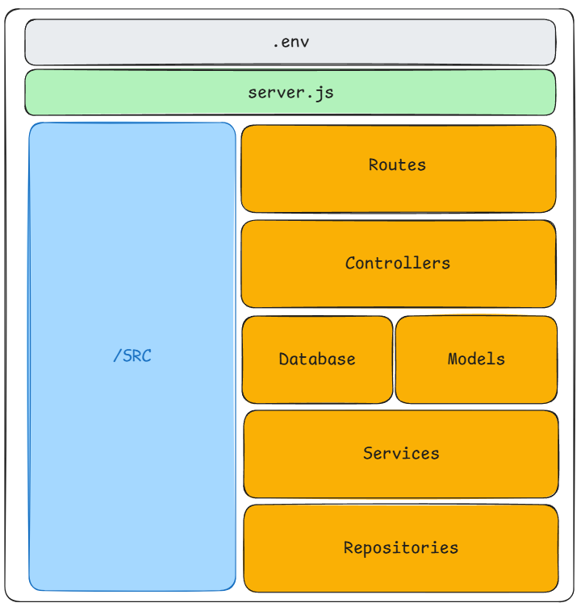
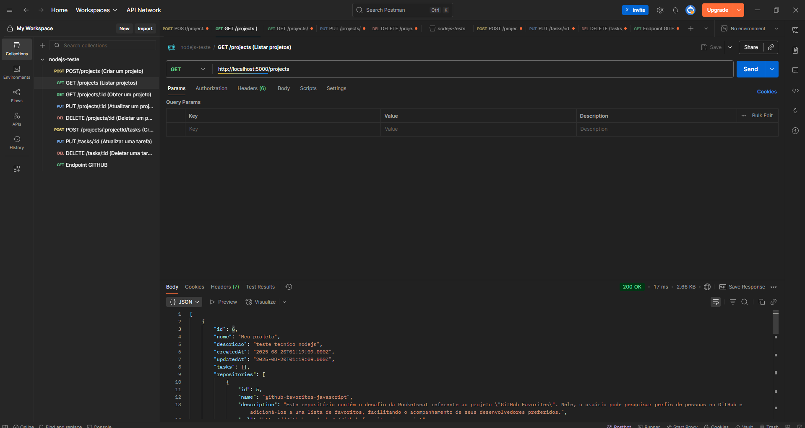
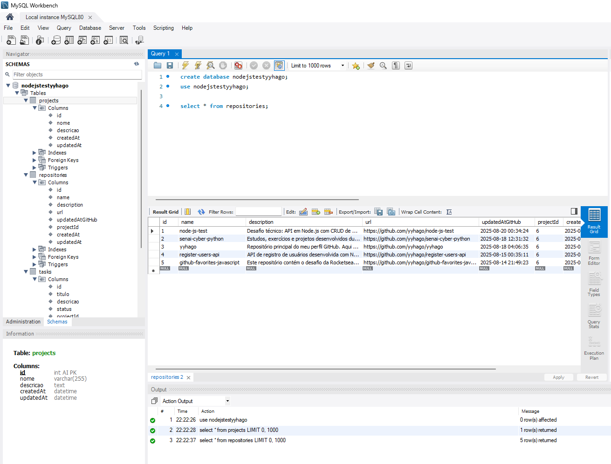

# API de Gerenciamento de Projetos e Tarefas

Uma API REST desenvolvida em Node.js com Express, Sequelize e MySQL para gerenciar projetos e suas tarefas associadas. A API oferece operações CRUD completas (criação, leitura, atualização e exclusão) tanto para projetos quanto para tarefas, além de integração com a API do GitHub para buscar repositórios públicos de usuários.





## 🚀 Descrição do Projeto

Esta API permite:
- Gerenciar projetos com CRUD completo
- Gerenciar tarefas vinculadas aos projetos
- Buscar os 5 últimos repositórios públicos de um usuário no GitHub
- Relacionamento entre projetos e tarefas (um projeto pode ter várias tarefas)
- Arquitetura em camadas bem estruturada (Controllers, Services, Repositories)
- Integração com banco de dados MySQL através do Sequelize ORM

## 🏗️ Arquitetura

O projeto segue uma arquitetura em camadas para melhor organização e manutenibilidade:

- **Controllers**: Responsáveis por receber as requisições HTTP e retornar respostas
- **Services**: Contêm a lógica de negócio da aplicação
- **Repositories**: Gerenciam o acesso aos dados e operações com o banco
- **Models**: Definem a estrutura das tabelas e relacionamentos do banco de dados

## 📋 Pré-requisitos

Antes de rodar o projeto, você precisa ter instalado:

- **Node.js** (versão 18.x ou superior)
- **MySQL** (versão 8.x ou superior)
- **Postman** ou outra ferramenta para testar APIs (opcional)

## 🔧 Instalação

1. **Clone o repositório:**
   ```bash
   git clone https://github.com/yyhago/node-js-test.git
   ```

2. **Navegue até o diretório:**
   ```bash
   cd node-js-test
   ```

3. **Instale as dependências:**
   ```bash
   npm install
   ```

4. **Configure as variáveis de ambiente:**
   - Configure as variáveis conforme mostrado abaixo, porem mude para suas credências do banco.
   - obs: O .env está apenas sendo enviado publicamente pois o recrutador tech pediu.

## 🌐 Variáveis de Ambiente

Crie um arquivo `.env` na raiz do projeto com as seguintes variáveis:

```env
DB_NAME=nodejstestyyhago
DB_USER=seuuser
DB_PASSWORD=suasenha
DB_HOST=localhost
DB_PORT=suaporta
```

- As variáveis de banco são essenciais para a conexão com o MySQL

## ▶️ Como Executar a API

1. **Crie o banco de dados no MySQL:**
   ```sql
   CREATE DATABASE nodejstestyyhago;
   ```

2. **Inicie a aplicação:**
   ```bash
   npm start
   ```

3. **Acesse a API:**
   A API estará disponível em `http://localhost:5000`

## 📚 Endpoints da API

### 🗂️ **Projetos**

| Método | Endpoint | Descrição |
|--------|----------|-----------|
| `POST` | `/projects` | Criar um novo projeto |
| `GET` | `/projects` | Listar todos os projetos com suas tarefas |
| `GET` | `/projects/:id` | Obter detalhes de um projeto específico |
| `PUT` | `/projects/:id` | Atualizar um projeto existente |
| `DELETE` | `/projects/:id` | Deletar um projeto e suas tarefas |

**Exemplo de body para criar projeto:**
```json
{
  "nome": "Projeto Teste",
  "descricao": "Descrição do projeto"
}
```

### ✅ **Tarefas**

| Método | Endpoint | Descrição |
|--------|----------|-----------|
| `POST` | `/projects/:projectId/tasks` | Criar uma tarefa vinculada a um projeto |
| `PUT` | `/tasks/:id` | Atualizar uma tarefa existente |
| `DELETE` | `/tasks/:id` | Deletar uma tarefa |

**Exemplo de body para criar tarefa:**
```json
{
  "titulo": "Tarefa Teste",
  "descricao": "Descrição da tarefa",
  "status": "Pendente"
}
```

### 🐙 **Integração GitHub**

| Método | Endpoint | Descrição |
|--------|----------|-----------|
| `GET` | `/projects/:id/github/:username` | Buscar os 5 últimos repositórios públicos de um usuário |

**Exemplo de resposta:**
```json
{
  "project": {
    "id": 1,
    "nome": "Projeto Teste"
  },
  "repositories": [
    {
      "name": "repo-exemplo",
      "description": "Descrição do repositório",
      "html_url": "https://github.com/usuario/repo-exemplo",
      "language": "JavaScript",
      "created_at": "2025-08-19T10:00:00Z"
    }
  ]
}
```

### 📝 **Campos Obrigatórios e Validações**

- **Projetos:** `nome` (obrigatório)
- **Tarefas:** `titulo` (obrigatório)
- **Status válidos para tarefas:** `Pendente`, `Em progresso`, `Concluida`

## 📤 Respostas da API

A API segue padrões REST com códigos de status HTTP apropriados:

- `201` - Criação bem-sucedida
- `200` - Leitura ou atualização bem-sucedida
- `204` - Deleção bem-sucedida (sem corpo de resposta)
- `400` - Erro de validação (campo obrigatório ausente ou status inválido)
- `404` - Recurso não encontrado
- `500` - Erro interno do servidor

**Exemplo de resposta ao criar um projeto:**
```json
{
  "id": 1,
  "nome": "Projeto Teste",
  "descricao": "Descrição do projeto",
  "createdAt": "2025-08-19T20:58:00.000Z",
  "updatedAt": "2025-08-19T20:58:00.000Z"
}
```

## 🧪 Testando a API

### Usando cURL:

**Criar um projeto:**
```bash
curl -X POST http://localhost:5000/projects \
  -H "Content-Type: application/json" \
  -d '{"nome": "Projeto Teste", "descricao": "Descrição do projeto"}'
```

**Buscar repositórios do GitHub:**
```bash
curl -X GET http://localhost:5000/projects/1/github/octocat
```

### Usando Postman:
1. Configure a URL base: `http://localhost:5000`
2. Teste os endpoints conforme documentado acima
3. Para a integração GitHub, use um username válido do GitHub


## 📁 Estrutura do Projeto

```
├── assets/                    # Recursos do projeto
│   ├── imageMySQL.png
│   ├── imagePostman.png
│   └── doc-teste-tecnico/
│       └── README.md
├── src/                       # Código fonte
│   ├── controllers/           # Controllers da aplicação
│   │   ├── ProjectsControllers.js
│   │   └── TasksControllers.js
│   ├── services/              # Lógica de negócio
│   │   ├── ProjectServices.js
│   │   └── TaskService.js
│   ├── repositories/          # Acesso aos dados
│   │   ├── ProjectRepository.js
│   │   ├── RepositoryRepository.js
│   │   └── TaskRepository.js
│   ├── models/               # Modelos Sequelize
│   │   ├── index.js
│   │   ├── projectsModel.js
│   │   ├── repositoriesGithub.js
│   │   └── tasksModel.js
│   ├── routes/               # Configuração das rotas
│   │   ├── index.js
│   │   ├── projects.routes.js
│   │   └── tasks.routes.js
│   └── database/             # Configuração do banco
│       └── database.js
├── .env                      # Variáveis de ambiente
├── .gitignore               # Arquivos ignorados pelo Git
├── README.md                # Documentação do projeto
├── package.json             # Dependências do projeto
└── server.js                # Arquivo principal
```

## 🛠️ Tecnologias Utilizadas

- **Node.js** - Runtime JavaScript
- **Express** - Framework web
- **Sequelize** - ORM para banco de dados
- **MySQL** - Sistema de gerenciamento de banco de dados
- **Axios** - Cliente HTTP para integração com APIs externas
- **dotenv** - Gerenciamento de variáveis de ambiente
- **Nodemon** - Desenvolvimento com hot reload

## 🔄 Histórico de Desenvolvimento

Este projeto foi desenvolvido seguindo uma abordagem incremental:

1. **CRUD de Projetos** - Implementação completa das operações básicas
2. **CRUD de Tarefas** - Adição das funcionalidades de tarefas vinculadas
3. **Refatoração para Controllers** - Organização do código em camadas
4. **Configuração do Banco** - Setup da conexão com MySQL
5. **Models Sequelize** - Criação dos esquemas e relacionamentos
6. **Arquitetura em Camadas** - Implementação de Services e Repositories
7. **Integração GitHub** - Adição da funcionalidade de buscar repositórios

